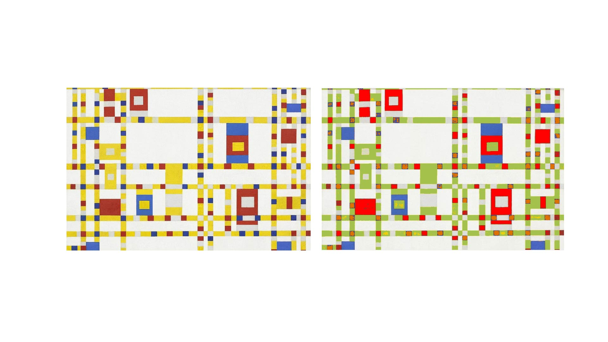

# HW08A
Generally how I detect color is by building a "isSimilar" function, what it does is that it checks if two colors are similar within a defined tolerance range. The function takes detected and target colors as input, with each color represented by its red, green, and blue (RGB) values. It then calculates the absolute difference between the RGB values of the two colors. If the differences for all three values are within the tolerance value, the function have detected the color.
I changed the red to user-picked color; the yellow to CELERY = color(164, 193, 77), a green color; the blue to (mango) TANGO = color(223, 113, 0) an orangel-like color.
I run my sketch on another image of Mondrian's paintiong with a similar color palate (see image attached). My code was able to switch the most color, but because the color is not uniform, my code is not able to change all the color, however because this new painting is using several different blue, my code is not working on the blue at all. By the way, the scaling function works just fine as expected.

Image on repo:  

